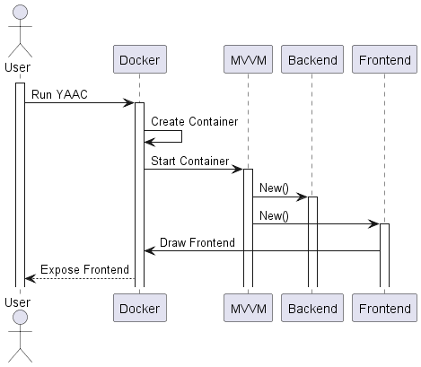

# Sequence Diagrams

## Creating the Diagrams

Diagrams are Created using [PlantUML](https://plantuml.com/sequence-diagram).

Creating sequence diagrams with PlantUML is remarkably straightforward. This ease of use is largely attributed to the user-friendly nature of its syntax, designed to be both intuitive and easy to remember.

## Starting YAAC

